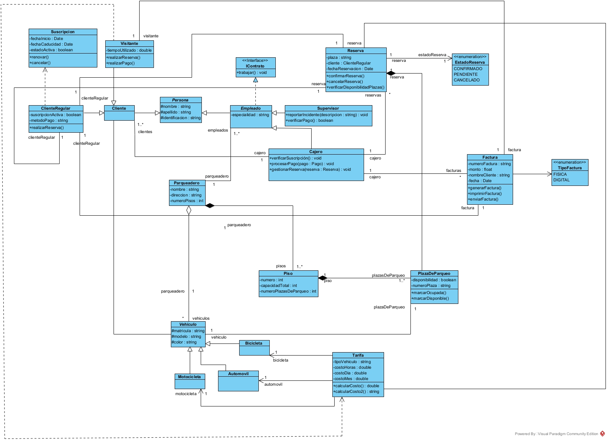

# Sistema de Gestión de Parqueadero
# Autor
* Fabricio Ruiz

## Descripción
Un sistema de gestión de parqueaderos tiene las siguientes características:

Un parqueadero está compuesto por múltiples pisos. Cada piso tiene varias plazas de parqueo.
Los vehículos pueden ser de diferentes tipos: automóviles, motocicletas y bicicletas. Todos comparten características comunes como matrícula, modelo y color, pero tienen atributos específicos según el tipo.
Los usuarios del parqueadero pueden ser clientes regulares o visitantes. Los clientes regulares tienen una suscripción activa y un método de pago asociado. Los visitantes pagan por el tiempo utilizado.
El sistema debe manejar las reservas. Un cliente regular puede realizar una reserva para una plaza específica.
Los empleados del parqueadero gestionan las operaciones. Un empleado puede ser un supervisor o un cajero.

De acuerdo al diagrama de clases (UML), generado en APE - parqueadero, implementar  en un lenguaje de programación(JAVA)
  
# Diagrama de Clases:

[Diagrama](https://github.com/Michu117/Parqueadero/blob/main/Parqueadero.jpg)

- Se eliminó el atributo idEmpleado en la clase Empleado.
- Se agregó el atributo especialidad en la clase Empleado.
- Se corrigió la multiplicidad de la asociación de las clases Cliente-Vehículo.

# Análisis Textual Final
El sistema de parqueadero en Java está diseñado para gestionar clientes, vehículos, empleados, reservas y plazas de aparcamiento utilizando un enfoque orientado a objetos basado en diagramas UML nativos. Los clientes que dispongan de abono y vehículo podrán reservar determinadas plazas de aparcamiento en el parking. Empleados como cajeros y supervisores procesan pagos y supervisan las operaciones, mientras que la estructura del piso facilita la organización y usabilidad del espacio.

# Clases Programadas
* [Main](https://github.com/Michu117/Parqueadero/blob/main/Parqueadero/src/Main.java)
* [Automovil](https://github.com/Michu117/Parqueadero/blob/main/Parqueadero/src/Automovil.java)
* [Bicicleta](https://github.com/Michu117/Parqueadero/blob/main/Parqueadero/src/Bicicleta.java)
* [Cajero](https://github.com/Michu117/Parqueadero/blob/main/Parqueadero/src/Cajero.java)
* [Cliente](https://github.com/Michu117/Parqueadero/blob/main/Parqueadero/src/Cliente.java)
* [ClienteRegular](https://github.com/Michu117/Parqueadero/blob/main/Parqueadero/src/ClienteRegular.java)
* [Empleado](https://github.com/Michu117/Parqueadero/blob/main/Parqueadero/src/Empleado.java)
* [EstadoReserva](https://github.com/Michu117/Parqueadero/blob/main/Parqueadero/src/EstadoReserva.java)
* [Factura](https://github.com/Michu117/Parqueadero/blob/main/Parqueadero/src/Factura.java)
* [IContrato](https://github.com/Michu117/Parqueadero/blob/main/Parqueadero/src/IContrato.java)
* [Motocicleta](https://github.com/Michu117/Parqueadero/blob/main/Parqueadero/src/Motocicleta.java)
* [Parqueadero](https://github.com/Michu117/Parqueadero/blob/main/Parqueadero/src/Parqueadero.java)
* [Persona](https://github.com/Michu117/Parqueadero/blob/main/Parqueadero/src/Persona.java)
* [Piso](https://github.com/Michu117/Parqueadero/blob/main/Parqueadero/src/Piso.java)
* [PlazaDeParqueo](https://github.com/Michu117/Parqueadero/blob/main/Parqueadero/src/PlazaDeParqueo.java)
* [Reserva](https://github.com/Michu117/Parqueadero/blob/main/Parqueadero/src/Reserva.java)
* [Supervisor](https://github.com/Michu117/Parqueadero/blob/main/Parqueadero/src/Supervisor.java)
* [Tarifa](https://github.com/Michu117/Parqueadero/blob/main/Parqueadero/src/Tarifa.java)
* [TipoFactura](https://github.com/Michu117/Parqueadero/blob/main/Parqueadero/src/TipoFactura.java)
* [Vehiculo](https://github.com/Michu117/Parqueadero/blob/main/Parqueadero/src/Vehiculo.java)
* [Visitante](https://github.com/Michu117/Parqueadero/blob/main/Parqueadero/src/Visitante.java)
